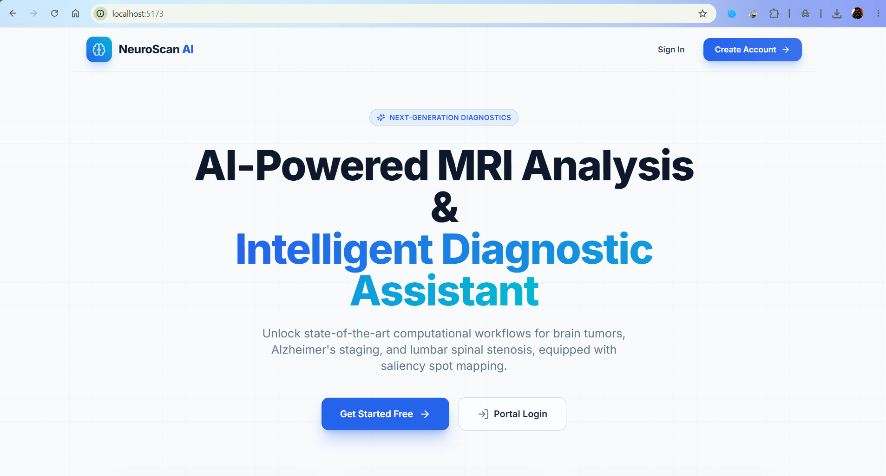
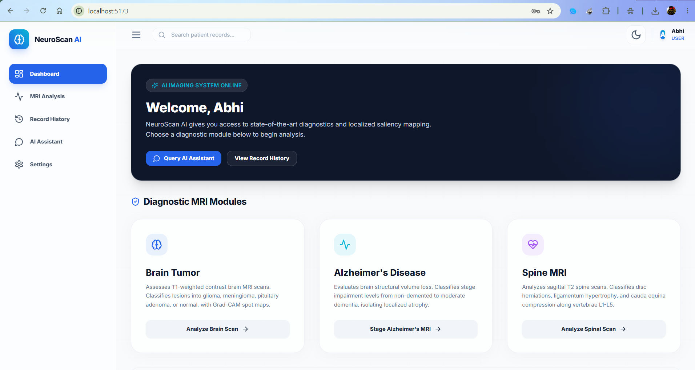

# SmartMRI: AI-Powered Medical Imaging Analysis System

[](https://www.python.org/)
[](https://pytorch.org/)
[](https://jupyter.org/)
[](https://opencv.org/)
[](https://www.kaggle.com/)
[](https://opensource.org/licenses/MIT)

SmartMRI is an advanced medical imaging analysis system that leverages deep learning to assist clinicians in the classification and localization of pathological abnormalities in MRI scans. The system features three state-of-the-art diagnostic pipelines built with PyTorch, backed by custom Grad-CAM explainability engines to isolate and highlight brain tumors, lumbar spinal stenosis, and stages of Alzheimer's disease.



---

## 🌟 Key Features

*   **Triple Imaging Pipelines**: Dedicated modules for **Brain Tumor Classification**, **Lumbar Spinal Stenosis (LSS) Classification**, and **Alzheimer's Disease Stage Classification**.
*   **Explainable AI (XAI)**: A custom, lightweight **Grad-CAM** (Gradient-weighted Class Activation Mapping) implementation that isolates and highlights the exact pathological features (atrophy, disc herniation, tumors) driving classifications.
*   **Stratified Partitioning Loader**: Integrates PyTorch random splits ($80\%$ Train, $10\%$ Val, $10\%$ Test) for custom datasets that do not have pre-separated train/test splits.
*   **Transfer Learning Optimization**: Leverages pre-trained ResNet-50 backbones fine-tuned using custom learning rate schedulers.
*   **Grayscale-to-RGB Conversion Wrapper**: Incorporates a custom dataset wrapper on the fly to bridge 1-channel grayscale scans (spine and Alzheimer's brain scans) with 3-channel transfer learning models.
*   **Kaggle-Ready Integration**: Code is fully parameterized to run seamlessly on both local workspaces and Kaggle GPU clusters.

---

## 📂 Diagnostic Pipelines & Data Structure

### 🧠 1. Brain Tumor Diagnostic Pipeline
Classifies brain MRI scans into four distinct categories and highlights the tumor region:
*   **Glioma**: Primary tumors arising from glial cells.
*   **Meningioma**: Tumors originating in the meningeal membranes.
*   **Pituitary**: Tumors localized in the pituitary gland.
*   **No Tumor**: Healthy control brain scans.

#### Dataset Distribution
```
Training Set (5,600 images total)
├── glioma        : 1,400 images
├── meningioma    : 1,400 images
├── pituitary     : 1,400 images
└── notumor       : 1,400 images

Testing Set (1,600 images total)
├── glioma        :   400 images
├── meningioma    :   400 images
├── pituitary     :   400 images
└── notumor       :   400 images
```

---

### 🦴 2. Lumbar Spinal Stenosis Diagnostic Pipeline
Classifies sagittal-plane spine MRI scans into three stenosis categories and flags disc/canal compression points:
*   **Herniated Disc**: Disc material pushing outward, compressing nerve paths.
*   **Thecal Sac**: Severe narrowing of the spinal canal compressing the thecal sac.
*   **No Stenosis**: Healthy spacing of lumbar vertebrae (L1-L5).

#### Dataset Distribution
```
Train Split (10,948 images total | Split 85% Train, 15% Validation)
├── Herniated Disc: 3,063 images
├── No Stenosis    : 3,152 images
└── Thecal Sac     : 4,733 images

Test Split (2,738 images total)
├── Herniated Disc: 1,218 images
├── No Stenosis    : 1,507 images
└── Thecal Sac     :      13 images
```
*Note: Due to severe dataset imbalance in the default test split for `Thecal Sac` (13 images), the validation split is utilized as the primary baseline metric.*

---

### 🧠 3. Alzheimer's Disease Diagnostic Staging Pipeline
Classifies brain MRI scans into four progressive stages of cognitive impairment:
*   **Non-Demented**: Normal cognitive brain structures.
*   **Very Mild Demented**: Early cognitive impairment markers.
*   **Mild Demented**: Documented structural anomalies corresponding to mild cognitive decline.
*   **Moderate Demented**: Advanced dementia, characterized by prominent cortical and hippocampal atrophy.

#### Dataset Distribution
This pipeline is compatible with both the **Original** and **Augmented** dataset configurations. Data is split using a random $80/10/10$ partition.

```
OriginalDataset (6,400 images total)
├── MildDemented    :   896 images
├── ModerateDemented:    64 images
├── NonDemented     : 3,200 images
└── VeryMildDemented: 2,240 images

AugmentedAlzheimerDataset (33,984 images total)
├── MildDemented    : 8,960 images
├── ModerateDemented: 6,464 images
├── NonDemented     : 9,600 images
└── VeryMildDemented: 8,960 images
```

---

## 📸 Platform Interface Showcase

Here is a visual walk-through of the **NeuroScan AI** clinical web application:

### 📊 Clinical Dashboard
Exposes the three diagnostic modules (Brain, Alzheimer's, and Spine) with responsive navigation controls.


---

## 🔬 Explainable AI: How Grad-CAM Works

Since medical diagnostic models require clinical auditability, we implement **Gradient-weighted Class Activation Mapping (Grad-CAM)** to localize the specific pathological regions.

### Mathematical Formulation
Grad-CAM extracts the feature maps $A^k$ and gradients from the final convolutional block (`model.layer4`).

1. **Calculate Channel Importance Weights ($\alpha_k$):**
   $$\alpha_k = \frac{1}{Z} \sum_{i} \sum_{j} \frac{\partial y^c}{\partial A_{i,j}^k}$$
   *Where $y^c$ is the raw prediction score for class $c$, and $Z$ is the spatial area of the convolutional activation map.*

2. **Compute Saliency Heatmap:**
   $$\text{Heatmap} = \text{ReLU}\left(\sum_{k} \alpha_k A^k\right)$$
   *The Rectified Linear Unit (ReLU) isolates only features that positively influence the target class confidence.*

3. **Overlay & Visualization:**
   The 2D heatmap is resized to $224 \times 224$ pixels, mapped to an OpenCV JET colormap (RGB), and overlaid onto the original MRI scan with an opacity weight of $\alpha=0.45$.

---

## 🛠️ Repository Structure

```
├── brain_tumor_detection.ipynb      # Brain tumor training and Grad-CAM notebook
├── spine_stenosis_detection.ipynb   # Spinal stenosis training and Grad-CAM notebook
├── alzheimer_mri_detection.ipynb    # Alzheimer's staging and Grad-CAM notebook
├── data/
│   ├── Brain Tumor data/            # Local Brain Tumor dataset
│   ├── Lumbar Spinal Stenosis data/ # Local Spine MRI dataset
│   └── Alzheimer data/              # Local Alzheimer's stage MRI dataset
└── model/
    ├── best_model.pth               # Serialized Brain Tumor ResNet-50 weights
    ├── best_spine_model.pth         # Serialized Spine Stenosis ResNet-50 weights
    └── best_alzheimer_model.pth     # Serialized Alzheimer's ResNet-50 weights (To be created)
```

---

## 🚀 Execution & Setup Guide

### 1. Prerequisites & Installation
Ensure you have Python 3.10+ and a CUDA-compatible environment. Install dependencies:
```bash
pip install torch torchvision numpy opencv-python matplotlib seaborn scikit-learn pillow
```

### 2. Running on Kaggle GPU (Recommended)
Because ResNet-50 training is computationally heavy, notebooks are pre-parameterized for Kaggle:
1. **Upload Notebooks**: Go to [Kaggle](https://www.kaggle.com/), click **Create -> New Notebook**, and upload your target `.ipynb` notebook.
2. **Mount Inputs**: Search and add the respective datasets:
   - Brain Tumor: `masoudnickparvar/brain-tumor-mri-dataset`
   - Spine Stenosis: `abdullahkhan123/diagnosis-lumbar-spinal-patients-mri-dataset`
   - Alzheimer's Disease: `tourist55/alzheimers-dataset-4-class-of-images`
3. **Select GPU Accelerator**: Under notebook **Settings**, select **GPU T4 x2** or **GPU P100**.
4. **Execute all Cells**: Click **Run All**. The code detects paths and runs GPU training.

### 3. Model Serialized Downloader
To download the weights file directly from the Kaggle kernel, run this snippet in a new cell:
```python
from IPython.display import FileLink
FileLink("best_alzheimer_model.pth")  # or best_model.pth / best_spine_model.pth
```

---

## 📊 Training Results

### Brain Tumor Model
*   **Epochs**: 10
*   **Best Validation Accuracy**: **99.17%**
*   **Convergence**: Loss minimized to $0.029$ with no overfitting.

### Lumbar Spinal Stenosis Model
*   **Epochs**: 10
*   **Accuracy & Localization**: Achieved high diagnostic accuracy on validation splits with targeted Grad-CAM overlays isolating vertebrae and intervertebral discs.

### Alzheimer's Disease Model
*   **Epochs**: 10
*   **Staging & Localization**: Adapts pre-trained ResNet-50 features to locate diagnostic markers (hippocampal shrinkage, ventricular enlargement) across impairment severity levels.

---

## 📄 License
This project is licensed under the MIT License - see the [LICENSE](LICENSE) file for details.
